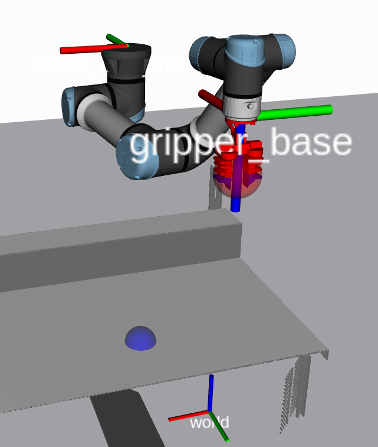

# FoR

Repository for the project of the course Fundamentals of Robotics
2023 - 2024

In this repo you will find the different exercises done with ROS and Gazebo.

## Install the environment
There are few possible ways to install the environment

[Docker](https://github.com/mfocchi/lab-docker)

[Natively on Linux](https://github.com/mfocchi/locosim)

[Virtual Machine image](http://www.dropbox.com/sh/5trh0s5y1xzdjds/AACchznJb7606MbQKb6-fUiUa)

In all the repos you should have all the information to install everything correctly

## How to create and build the packages

```bash
  cd ~/catkin_ws/src
  catkin_create_pkg package_name [dep1] [dep2] ...
```

Usually these are the dependencies used: std_msgs rospy roscpp

After creating the package you need to build it
```bash
  catkin_make
  source ~/catkin_ws/devel/setup.bash
```

**_NOTE:_** 
After creating the workspace, and after any change you have to use the source command to update the environment variables and functions

## Customize the packages
The call to catkin_create_pkg generates two files that allow you to make personalisations, package.xml and CMakeLists.txt

### package.xml
Most of times it sufficies to set the dependencies:
```xml
<build_depend>package_name</build_depend>
<run_depend>package_name</run_depend>
```
Other info are not mandatory to be modified.

### Ros launch
It's not a file automatically created ad build but can be defined by the user
to launch multiple nodes at once.

First create it if not already there
[Launch XML](https://wiki.ros.org/roslaunch/XML)
```bash
  roscd [package name]
  mkdir launch
  cd launch
  gedit [filename].launch
```
And then use it with
```bash
  roslaunch [package] [filename.launch]
```

### CMakeLists.txt
Just define the packages and dependencies, the messages and services that the node could 
use and the definition of the executables and the libraries dependencies.

Usually this are the definitions used:
```bash
  find_package(catkin REQUIRED COMPONENTS
    roscpp
    rospy
    std_msgs
    message_generation
  )

  add_message_files(
    FILES
    [message name].msg
  )

  generate_messages(
    DEPENDENCIES
    std_msgs
  )

  add_service_files(
    FILES
    [service name].srv
  )

  add_executable([node name] src/[source node])
  target_link_libraries([node name] ${catkin_LIBRARIES})
  add_dependencies([node name] [dep])
```
Remember to always [Build and Update](#how-to-create-and-build-the-packages) the package

## General notes

- What values should have **gripper_sim** in params.py file?

  While testing the different packages, it depends but during the **final test** it must
  be **True**.

- What **frame** we need to use to make the measurements (cartesian position)? 
  
  In RViz, select from TF -> Frames -> **base_link_inertia**. 
  
  This is the frame from which we can take the measurements and check the final position of end effector.

  In short: 

  **X positive** -> go to the **left** of the table

  **Y positive** -> go in the **'inner'** side of the table

  **Z positive** -> go **down**
    


- What about **euler** rotations?

  The angles are refered to the **base_link_inertia**.

  The configuration shown on the image is with angles 0, 0, 0 (XYZ). So, for example, a rotation of pi/2 about Y will make point the end effector in the same direction of X axis of the base_link_inertia.

- What value should have the **scale factor**?
  
  It depends on how you want to develop the project.

  A scale factor of **10** gives you measurements in **centimeters**.

  A scale factor of **1** gives you measurements in **meters**. 

  And so on...

- How can we grap the objects?

  Knowing the X, Y of the object we need to specify the Z and the opening of the gripper.
  
  For **Z** we can use **0.73** and as **opening**, **45-45** which is the max.
  After that, we can **close** the **gripper** with **-0.1 -0.1**.

  **Note** that there can be some problems of **collisions** with object that can generate some **bugs**
